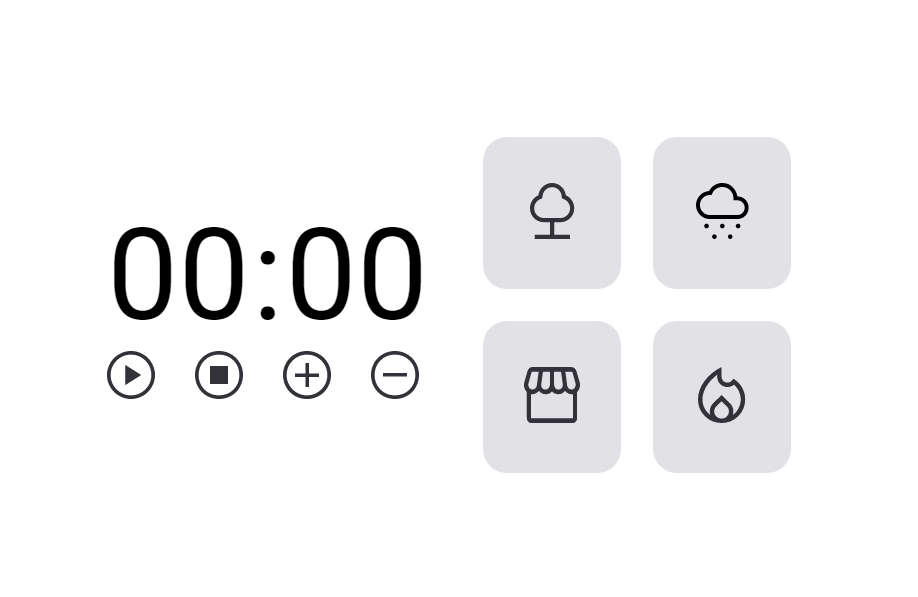

# Focus Timer - Trila Explorer

> Trila Explorer

Este projeto foi desenvolvido como um dos desafios do curso da Rocketseat, com o objetivo de aplicar os conhecimentos adquiridos durante as aulas. Trata-se de um cronômetro que permite um tempo máximo de 90 minutos. É possível adicionar ou remover tempo em incrementos de 5 minutos usando os botões "+" e "-". Além disso, ao pressionar os cards laterais, é possível reproduzir músicas.

Foi uma experiência interessante desenvolver este projeto, e pretendo fazer algumas melhorias no futuro à medida que eu me desenvolvo e aprendo mais recursos.

🔗 [Clique aqui para acessar](https://gabrielzacariassoler.github.io/FocusTimer/)

## 🛠️ Tecnologias

- HTML
- CSS
- JAVASCRIPT

## ❤️ Contato

gabrielzsdev@gmail.com
